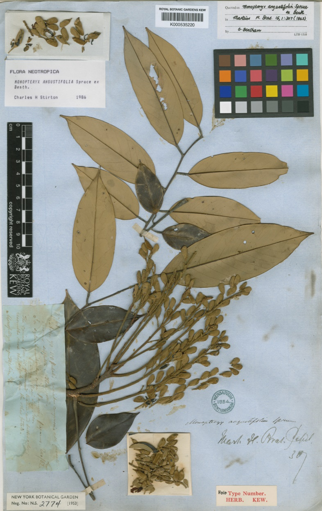
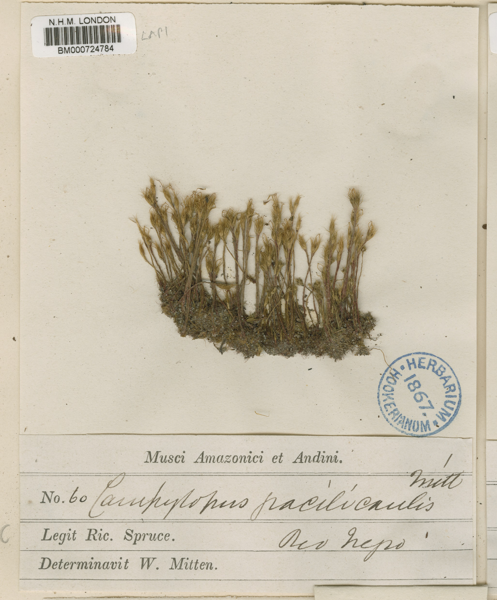
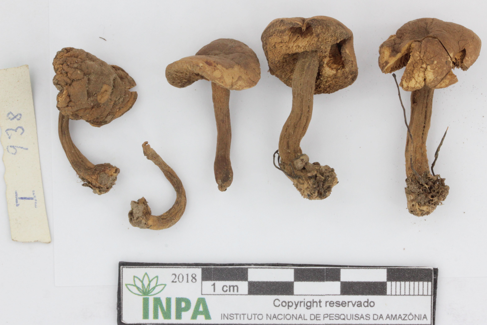
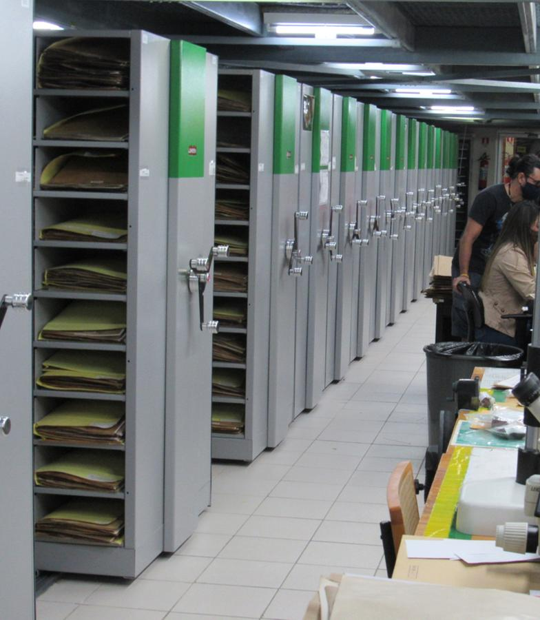

```{r conservacao-setup, include=FALSE}
knitr::opts_chunk$set(echo = FALSE, warning = FALSE, message = FALSE)

suppressPackageStartupMessages({
  library(dplyr)
  library(tidyr)
  library(stringr)
  library(readxl)
  library(lubridate)
  library(plotly)
  library(htmltools)
  library(scales)
})

nz <- function(x) !is.na(x) & nzchar(trimws(as.character(x)))

clean_text <- function(x) {
  x <- as.character(x)
  x[is.na(x)] <- NA_character_
  stringr::str_squish(x)
}

format_int <- function(x) {
  if (length(x) == 0) return("—")
  out <- rep("—", length(x))
  x_chr <- as.character(x)
  x_chr[is.na(x_chr)] <- NA_character_
  x_num <- suppressWarnings(as.numeric(gsub("\\.", "", x_chr)))
  ok_num <- !is.na(x_num)
  out[ok_num] <- format(
    x_num[ok_num],
    big.mark = ".",
    decimal.mark = ",",
    scientific = FALSE,
    trim = TRUE
  )
  ok_text <- !ok_num & !is.na(x_chr) & nzchar(trimws(x_chr))
  out[ok_text] <- x_chr[ok_text]
  if (length(out) == 1) out[[1]] else out
}

`%||%` <- function(x, y) if (is.null(x)) y else x

find_up <- function(rel_path, start = getwd(), max_levels = 8) {
  d <- normalizePath(start, winslash = "/", mustWork = FALSE)
  for (i in 0:max_levels) {
    cand <- file.path(d, rel_path)
    if (file.exists(cand)) return(cand)
    parent <- dirname(d)
    if (identical(parent, d)) break
    d <- parent
  }
  NA_character_
}

find_first <- function(paths) {
  paths <- unique(paths[!is.na(paths) & nzchar(paths)])
  found <- vapply(paths, find_up, character(1))
  hit <- found[!is.na(found)]
  if (length(hit) == 0) return(NA_character_)
  hit[1]
}

as_num <- function(x) {
  suppressWarnings(as.numeric(stringr::str_replace(as.character(x), ",", ".")))
}

to_year <- function(x) {
  if (length(x) == 0) return(integer())
  if (is.numeric(x)) {
    y <- suppressWarnings(as.integer(x))
    y[y < 1500 | y > lubridate::year(Sys.Date()) + 2] <- NA_integer_
    return(y)
  }
  x_chr <- stringr::str_squish(as.character(x))
  y1 <- suppressWarnings(as.integer(x_chr))
  y1[y1 < 1500 | y1 > lubridate::year(Sys.Date()) + 2] <- NA_integer_
  needs_parse <- is.na(y1) & nz(x_chr)
  if (any(needs_parse)) {
    parsed <- suppressWarnings(lubridate::parse_date_time(
      x_chr[needs_parse],
      orders = c("ymd", "dmy", "mdy", "Y", "Ym", "Ymd", "dmY", "mdY"),
      quiet = TRUE
    ))
    y1[needs_parse] <- lubridate::year(parsed)
  }
  y1
}

empty_catalog <- function() {
  tibble::tibble(
    source = character(),
    scientificName = character(),
    taxonRank = character(),
    taxon_resolution = character(),
    is_species_level = logical(),
    species_key = character(),
    genus = character(),
    family = character(),
    kingdom = character(),
    phylum = character(),
    class = character(),
    order = character(),
    group = character(),
    year = integer(),
    record_id = character(),
    latitude = numeric(),
    longitude = numeric(),
    has_coordinates = logical(),
    is_project_source = logical()
  )
}

read_dwc_xlsx <- function(path) {
  sheets <- readxl::excel_sheets(path)
  sheet <- if ("DwC_records" %in% sheets) "DwC_records" else sheets[[1]]
  dat <- readxl::read_xlsx(path, sheet = sheet, .name_repair = "unique") |>
    tibble::as_tibble(.name_repair = "unique")
  names(dat) <- trimws(gsub("^\ufeff", "", names(dat)))
  dat
}

ensure_catalog_cols <- function(dat, source_label = NA_character_) {
  req <- names(empty_catalog())
  for (cc in req) {
    if (!cc %in% names(dat)) dat[[cc]] <- NA
  }

  # O index não faz validação taxonômica pesada. Ele só normaliza tipos e lê
  # as colunas já criadas pelo script externo de validação.
  dat <- dat |>
    mutate(
      source = ifelse(nz(source), clean_text(source), source_label),
      scientificName = clean_text(scientificName),
      taxonRank = clean_text(taxonRank),
      taxon_resolution = clean_text(taxon_resolution),
      species_key = clean_text(species_key),
      genus = clean_text(genus),
      family = clean_text(family),
      kingdom = clean_text(kingdom),
      phylum = clean_text(phylum),
      class = clean_text(class),
      order = clean_text(order),
      group = clean_text(group),
      record_id = clean_text(record_id),
      year = to_year(year),
      latitude = as_num(latitude),
      longitude = as_num(longitude),
      is_species_level = is_species_level %in% c(TRUE, "TRUE", "true", "1", 1),
      has_coordinates = (!is.na(latitude) & !is.na(longitude)) | has_coordinates %in% c(TRUE, "TRUE", "true", "1", 1),
      is_project_source = is_project_source %in% c(TRUE, "TRUE", "true", "1", 1) |
        source == "Expedições Tsiino Hiiwiida",
      taxon_resolution = case_when(
        taxon_resolution %in% c("Até espécie", "Até gênero", "Até família", "Indeterminados") ~ taxon_resolution,
        TRUE ~ "Indeterminados"
      ),
      group = case_when(
        group %in% c("Fanerógamas", "Criptógamas", "Fungos") ~ group,
        TRUE ~ "Indeterminado"
      ),
      species_key = ifelse(is_species_level & nz(species_key), species_key, NA_character_)
    ) |>
    select(any_of(req), everything())

  dat
}

read_validated_dwc_input <- function(paths, label, source_label) {
  path <- find_first(paths)
  if (is.na(path)) {
    return(list(
      data = empty_catalog(),
      path = NA_character_,
      label = label,
      found = FALSE,
      rows = 0L,
      message = paste0(
        "Arquivo validado não encontrado para ", label,
        ". Nomes esperados: ", paste(basename(paths), collapse = ", ")
      )
    ))
  }

  dat <- tryCatch(
    read_dwc_xlsx(path),
    error = function(e) {
      warning("Erro ao ler ", label, ": ", conditionMessage(e))
      empty_catalog()
    }
  )

  dat <- ensure_catalog_cols(dat, source_label = source_label)
  dat$source <- source_label
  dat$is_project_source <- source_label == "Expedições Tsiino Hiiwiida"

  list(
    data = dat,
    path = normalizePath(path, winslash = "/", mustWork = FALSE),
    label = label,
    found = TRUE,
    rows = nrow(dat),
    message = paste0(
      label, " lido em ", normalizePath(path, winslash = "/", mustWork = FALSE),
      ". ", format_int(nrow(dat)), " registros."
    )
  )
}

exp_input <- read_validated_dwc_input(
  c(
    "_input_data/dwc_expedicoes_tsiino_validado.xlsx",
    "../_input_data/dwc_expedicoes_tsiino_validado.xlsx",
    "conservacao/_input_data/dwc_expedicoes_tsiino_validado.xlsx",
    "_input_data/dwc_expedicoes_tsiino_tratado.xlsx",
    "../_input_data/dwc_expedicoes_tsiino_tratado.xlsx",
    "conservacao/_input_data/dwc_expedicoes_tsiino_tratado.xlsx",
    "_input_data/dwc_expedicoes_tsiino.xlsx",
    "../_input_data/dwc_expedicoes_tsiino.xlsx",
    "conservacao/_input_data/dwc_expedicoes_tsiino.xlsx"
  ),
  label = "Expedições Tsiino Hiiwiida",
  source_label = "Expedições Tsiino Hiiwiida"
)

gbif_input <- read_validated_dwc_input(
  c(
    "_input_data/dwc_gbif_colecoes_validado.xlsx",
    "../_input_data/dwc_gbif_colecoes_validado.xlsx",
    "conservacao/_input_data/dwc_gbif_colecoes_validado.xlsx",
    "_input_data/dwc_gbif_colecoes_tratado.xlsx",
    "../_input_data/dwc_gbif_colecoes_tratado.xlsx",
    "conservacao/_input_data/dwc_gbif_colecoes_tratado.xlsx",
    "_input_data/dwc_gbif_colecoes.xlsx",
    "../_input_data/dwc_gbif_colecoes.xlsx",
    "conservacao/_input_data/dwc_gbif_colecoes.xlsx"
  ),
  label = "Coleções existentes / GBIF",
  source_label = "Coleções existentes / GBIF"
)

catalog_all_dwc <- bind_rows(exp_input$data, gbif_input$data)
valid_groups <- c("Fanerógamas", "Criptógamas", "Fungos")

catalog_species_dwc <- catalog_all_dwc |>
  filter(
    group %in% valid_groups,
    is_species_level,
    nz(species_key)
  )

input_status_panel <- function() {
  file_card <- function(input) {
    tags$div(
      class = paste("input-file", ifelse(input$found, "input-ok", "input-missing")),
      tags$span(ifelse(input$found, "Encontrado", "Aguardando")),
      tags$strong(input$label),
      tags$p(input$message)
    )
  }

  tags$div(
    class = "input-status-grid reveal",
    `data-reveal` = "",
    file_card(exp_input),
    file_card(gbif_input)
  )
}

taxon_resolution_df <- function(dat) {
  if (nrow(dat) == 0 || !"taxon_resolution" %in% names(dat)) {
    return(tibble::tibble(resolucao = character(), registros = integer()))
  }
  levels <- c("Até espécie", "Até gênero", "Até família", "Indeterminados")
  dat |>
    mutate(
      resolucao = case_when(
        taxon_resolution %in% levels ~ taxon_resolution,
        TRUE ~ "Indeterminados"
      ),
      resolucao = factor(resolucao, levels = levels)
    ) |>
    count(resolucao, name = "registros") |>
    tidyr::complete(resolucao = factor(levels, levels = levels), fill = list(registros = 0L)) |>
    mutate(resolucao = as.character(resolucao)) |>
    filter(registros > 0)
}

calc_stats <- function(group_filter = NULL) {
  all_dat <- catalog_all_dwc |>
    filter(group %in% valid_groups)
  species_dat <- catalog_species_dwc
  exp_all <- catalog_all_dwc |>
    filter(group %in% valid_groups, source == "Expedições Tsiino Hiiwiida")
  gbif_all <- catalog_all_dwc |>
    filter(group %in% valid_groups, source == "Coleções existentes / GBIF")
  exp_species <- catalog_species_dwc |>
    filter(source == "Expedições Tsiino Hiiwiida")
  gbif_species <- catalog_species_dwc |>
    filter(source == "Coleções existentes / GBIF")

  if (!is.null(group_filter)) {
    all_dat <- all_dat |> filter(group == group_filter)
    species_dat <- species_dat |> filter(group == group_filter)
    exp_all <- exp_all |> filter(group == group_filter)
    gbif_all <- gbif_all |> filter(group == group_filter)
    exp_species <- exp_species |> filter(group == group_filter)
    gbif_species <- gbif_species |> filter(group == group_filter)
  }

  exp_keys <- exp_species |> filter(nz(species_key)) |> pull(species_key) |> unique()
  gbif_keys <- gbif_species |> filter(nz(species_key)) |> pull(species_key) |> unique()
  new_keys <- if (length(exp_keys) == 0) character() else setdiff(exp_keys, gbif_keys)

  list(
    data = species_dat,
    all_data = all_dat,
    exp_data = exp_species,
    gbif_data = gbif_species,
    exp_all_data = exp_all,
    gbif_all_data = gbif_all,
    group = group_filter %||% "Geral",
    records = nrow(all_dat),
    species = species_dat |> filter(nz(species_key)) |> summarise(n = n_distinct(species_key)) |> pull(n),
    genera = all_dat |> filter(nz(genus)) |> summarise(n = n_distinct(genus)) |> pull(n),
    families = all_dat |> filter(nz(family)) |> summarise(n = n_distinct(family)) |> pull(n),
    exp_records = nrow(exp_all),
    gbif_records = nrow(gbif_all),
    georef_records = all_dat |> filter(has_coordinates) |> nrow(),
    new_records = length(new_keys),
    new_keys = new_keys,
    resolution = taxon_resolution_df(all_dat)
  )
}

kpi_card <- function(value, label, note = NULL) {
  raw_value <- suppressWarnings(as.numeric(gsub("\\.", "", as.character(value))))
  final_text <- as.character(value)
  tags$div(
    class = "kpi-card reveal",
    `data-reveal` = "",
    tags$strong(
      class = "kpi-number",
      `data-count-final` = ifelse(is.na(raw_value), "", raw_value),
      `data-final-text` = final_text,
      final_text
    ),
    tags$span(label),
    if (!is.null(note)) tags$p(note)
  )
}

empty_state <- function(text) {
  tags$div(class = "empty-state", text)
}

top_genus_df <- function(dat, n = 8) {
  dat |>
    filter(nz(genus), nz(species_key)) |>
    distinct(genus, species_key) |>
    count(genus, name = "species") |>
    arrange(desc(species), genus) |>
    slice_head(n = n)
}

top_family_df <- function(dat, n = 8) {
  dat |>
    filter(nz(family), nz(species_key)) |>
    distinct(family, species_key) |>
    count(family, name = "species") |>
    arrange(desc(species), family) |>
    slice_head(n = n)
}

rank_list_card <- function(dat, type = c("family", "genus"), n = 7) {
  type <- match.arg(type)
  top <- if (type == "family") top_family_df(dat, n) else top_genus_df(dat, n)
  label_col <- if (type == "family") "family" else "genus"
  title <- if (type == "family") "Famílias com maior riqueza" else "Gêneros com maior riqueza"
  empty_msg <- if (type == "family") "Inclua espécies com família validada para listar famílias mais ricas." else "Inclua espécies com gênero validado para listar gêneros mais ricos."
  body <- if (nrow(top) == 0) {
    empty_state(empty_msg)
  } else {
    tags$ol(
      class = "rank-list",
      lapply(seq_len(nrow(top)), function(i) {
        tags$li(
          tags$span(top[[label_col]][i]),
          tags$b(paste0(format_int(top$species[i]), " spp."))
        )
      })
    )
  }
  tags$div(
    class = "chart-card rank-card reveal",
    `data-reveal` = "",
    tags$h4(title),
    body
  )
}

plot_source_balance <- function(stats) {
  dat <- tibble(
    fonte = c("Expedições", "Coleções/GBIF"),
    registros = c(stats$exp_records, stats$gbif_records),
    cor = c("#A93632", "#626A38")
  ) |>
    filter(registros > 0)
  if (nrow(dat) == 0) return(empty_state("Quando os inputs forem adicionados, esta área mostrará a composição das fontes."))
  plot_ly(
    dat,
    labels = ~fonte,
    values = ~registros,
    type = "pie",
    hole = 0.56,
    sort = FALSE,
    textinfo = "label+percent",
    textposition = "inside",
    insidetextorientation = "radial",
    marker = list(colors = dat$cor, line = list(color = "#FFFDF7", width = 2)),
    hovertemplate = "%{label}<br>%{value} registros<br>%{percent}<extra></extra>"
  ) |>
    layout(
      title = list(text = "Registros por fonte", font = list(size = 14, family = "Montserrat", color = "#2E3B24")),
      uniformtext = list(minsize = 10, mode = "hide"),
      margin = list(l = 16, r = 16, t = 58, b = 46),
      paper_bgcolor = "rgba(0,0,0,0)",
      plot_bgcolor = "rgba(0,0,0,0)",
      font = list(family = "Montserrat", color = "#171717"),
      showlegend = TRUE,
      legend = list(orientation = "h", x = 0, y = -0.12)
    ) |>
    config(displayModeBar = FALSE, responsive = TRUE)
}

plot_taxon_resolution <- function(stats) {
  dat <- stats$resolution
  if (is.null(dat) || nrow(dat) == 0) return(empty_state("Inclua nomes científicos, gêneros, famílias ou taxonRank para visualizar o nível de identificação dos registros."))
  palette <- c(
    "Até espécie" = "#A93632",
    "Até gênero" = "#D99A27",
    "Até família" = "#626A38",
    "Indeterminados" = "#2E3B24"
  )
  dat <- dat |> mutate(cor = unname(palette[resolucao]))
  plot_ly(
    dat,
    labels = ~resolucao,
    values = ~registros,
    type = "pie",
    hole = 0.58,
    sort = FALSE,
    textinfo = "percent",
    textposition = "inside",
    insidetextorientation = "radial",
    marker = list(colors = dat$cor, line = list(color = "#FFFDF7", width = 2)),
    hovertemplate = "%{label}<br>%{value} registros<br>%{percent}<extra></extra>"
  ) |>
    layout(
      title = list(text = "Nível de identificação dos registros", y = 0.98, font = list(size = 14, family = "Montserrat", color = "#2E3B24")),
      uniformtext = list(minsize = 10, mode = "hide"),
      margin = list(l = 18, r = 18, t = 82, b = 64),
      paper_bgcolor = "rgba(0,0,0,0)",
      plot_bgcolor = "rgba(0,0,0,0)",
      font = list(family = "Montserrat", color = "#171717"),
      showlegend = TRUE,
      legend = list(orientation = "h", x = 0, y = -0.15)
    ) |>
    config(displayModeBar = FALSE, responsive = TRUE)
}

plot_group_balance <- function(dat) {
  gd <- dat |>
    filter(group %in% valid_groups) |>
    count(group, name = "registros") |>
    arrange(match(group, valid_groups))
  if (nrow(gd) == 0) return(empty_state("Inclua registros classificados por grupo biológico para visualizar a composição do painel."))
  palette <- c("Fanerógamas" = "#626A38", "Criptógamas" = "#D99A27", "Fungos" = "#A93632")
  gd <- gd |> mutate(cor = unname(palette[group]))
  plot_ly(
    gd,
    labels = ~group,
    values = ~registros,
    type = "pie",
    hole = 0.56,
    sort = FALSE,
    textinfo = "label+percent",
    textposition = "inside",
    insidetextorientation = "radial",
    marker = list(colors = gd$cor, line = list(color = "#FFFDF7", width = 2)),
    hovertemplate = "%{label}<br>%{value} registros<br>%{percent}<extra></extra>"
  ) |>
    layout(
      title = list(text = "Registros por grupo biológico", font = list(size = 14, family = "Montserrat", color = "#2E3B24")),
      uniformtext = list(minsize = 10, mode = "hide"),
      margin = list(l = 16, r = 16, t = 58, b = 46),
      paper_bgcolor = "rgba(0,0,0,0)",
      plot_bgcolor = "rgba(0,0,0,0)",
      font = list(family = "Montserrat", color = "#171717"),
      showlegend = TRUE,
      legend = list(orientation = "h", x = 0, y = -0.12)
    ) |>
    config(displayModeBar = FALSE, responsive = TRUE)
}

plot_years <- function(dat) {
  yy <- dat |>
    filter(!is.na(year)) |>
    mutate(year = as.integer(year)) |>
    filter(!is.na(year)) |>
    count(year, name = "records") |>
    arrange(year)
  if (nrow(yy) == 0) return(empty_state("Inclua eventDate ou year para visualizar o histórico de coletas."))
  yy <- yy |>
    tidyr::complete(year = seq(min(year, na.rm = TRUE), max(year, na.rm = TRUE), by = 1), fill = list(records = 0L)) |>
    arrange(year)
  plot_ly(
    yy,
    x = ~year,
    y = ~records,
    type = "scatter",
    mode = "lines+markers",
    line = list(color = "#A93632", width = 3, shape = "linear"),
    marker = list(color = "#D99A27", size = 6, line = list(color = "#6E1F1D", width = 1)),
    fill = "tozeroy",
    fillcolor = "rgba(217,154,39,0.14)",
    hovertemplate = "%{x}<br>%{y} registros<extra></extra>"
  ) |>
    layout(
      title = list(text = "Registros ao longo do tempo", font = list(size = 14, family = "Montserrat", color = "#2E3B24")),
      xaxis = list(title = "Ano", color = "#675F55", zeroline = FALSE, showgrid = FALSE),
      yaxis = list(title = "Registros", color = "#675F55", zeroline = FALSE, showgrid = FALSE),
      margin = list(l = 55, r = 24, t = 54, b = 45),
      paper_bgcolor = "rgba(0,0,0,0)",
      plot_bgcolor = "rgba(0,0,0,0)",
      font = list(family = "Montserrat", color = "#171717"),
      showlegend = FALSE
    ) |>
    config(displayModeBar = FALSE, responsive = TRUE)
}

species_list_df <- function(dat) {
  dat |>
    filter(nz(species_key)) |>
    mutate(
      family = ifelse(nz(family), family, "Família não informada"),
      species_key = stringr::str_to_sentence(species_key)
    ) |>
    group_by(family, species_key) |>
    summarise(records = n(), sources = n_distinct(source), .groups = "drop") |>
    arrange(family, species_key)
}

species_drawer <- function(stats) {
  dat <- species_list_df(stats$data)
  if (nrow(dat) == 0) {
    return(tags$div(class = "species-drawer-empty reveal", `data-reveal` = "", "Inclua nomes científicos em nível de espécie no input tratado para gerar a lista completa deste grupo."))
  }
  new_keys <- stats$new_keys
  if (length(new_keys) == 1 && is.na(new_keys)) new_keys <- character()
  dat <- dat |>
    mutate(
      is_new = species_key %in% stringr::str_to_sentence(new_keys),
      record_label = dplyr::if_else(records == 1, "1 registro", paste0(format_int(records), " registros"))
    )
  tags$details(
    class = "species-drawer reveal",
    `data-reveal` = "",
    tags$summary(
      tags$span(class = "species-summary-label", "Ver lista completa de espécies"),
      tags$span(class = "species-summary-count", paste0(format_int(nrow(dat)), " espécies"))
    ),
    tags$div(
      class = "species-drawer-panel",
      tags$div(
        class = "species-drawer-intro",
        tags$div(tags$span(class = "eyebrow", paste("Lista", stats$group)), tags$h4("Espécies registradas no painel")),
        tags$p("A lista mostra apenas nomes completos identificados em nível de espécie, já normalizados no script externo, com família associada e quantidade de registros.")
      ),
      tags$div(
        class = "species-list-grid",
        lapply(seq_len(nrow(dat)), function(i) {
          tags$article(
            class = paste("species-list-card", ifelse(dat$is_new[i], "is-new", "")),
            tags$div(class = "species-family-line", tags$span(dat$family[i]), if (dat$is_new[i]) tags$b("novo potencial")),
            tags$em(dat$species_key[i]),
            tags$small(dat$record_label[i])
          )
        })
      )
    )
  )
}

render_dashboard <- function(title, subtitle, group_filter = NULL, compact = FALSE) {
  stats <- calc_stats(group_filter)
  dat <- stats$data
  all_dat <- stats$all_data
  kpis <- tags$div(
    class = "kpi-grid",
    kpi_card(format_int(stats$species), "espécies", "Apenas nomes completos identificados em nível de espécie."),
    kpi_card(format_int(stats$genera), "gêneros", "Gêneros distintos considerando registros até espécie ou até gênero."),
    kpi_card(format_int(stats$families), "famílias", "Famílias distintas considerando registros até espécie, gênero ou família."),
    kpi_card(format_int(stats$records), "registros", "Todas as ocorrências do grupo, incluindo espécie, gênero, família e indeterminados."),
    kpi_card(format_int(stats$new_records), "novos registros potenciais", "Só espécies completas das expedições ausentes no input GBIF/coleções."),
    kpi_card(format_int(stats$georef_records), "georreferenciados", "Todos os registros do grupo com latitude e longitude disponíveis.")
  )

  family_card <- rank_list_card(dat, "family", 7)
  genus_card <- rank_list_card(dat, "genus", 7)

  if (is.null(group_filter)) {
    visual_cards <- list(
      tags$div(class = "chart-card reveal", `data-reveal` = "", plot_source_balance(stats)),
      tags$div(class = "chart-card reveal", `data-reveal` = "", plot_taxon_resolution(stats)),
      tags$div(class = "chart-card reveal", `data-reveal` = "", plot_years(all_dat)),
      tags$div(class = "chart-card reveal", `data-reveal` = "", plot_group_balance(all_dat)),
      family_card,
      genus_card
    )
  } else {
    visual_cards <- list(
      tags$div(class = "chart-card reveal", `data-reveal` = "", plot_source_balance(stats)),
      tags$div(class = "chart-card reveal", `data-reveal` = "", plot_years(all_dat)),
      family_card,
      genus_card
    )
  }

  tagList(
    tags$section(
      class = paste("dashboard-block", if (compact) "dashboard-compact" else ""),
      tags$div(
        class = "dashboard-heading reveal",
        `data-reveal` = "",
        tags$span(class = "eyebrow", ifelse(is.null(group_filter), "Painel integrado", group_filter)),
        tags$h3(title),
        tags$p(subtitle)
      ),
      kpis,
      do.call(tags$div, c(list(class = "dashboard-visual-grid"), visual_cards)),
      if (!is.null(group_filter)) species_drawer(stats)
    )
  )
}
```

```{=html}
<link rel="preconnect" href="https://fonts.googleapis.com">
<link rel="preconnect" href="https://fonts.gstatic.com" crossorigin>
<link href="https://fonts.googleapis.com/css2?family=Montserrat:wght@400;500;600;700;800;900&family=Source+Serif+4:opsz,wght@8..60,400;8..60,600;8..60,700&family=Space+Mono:wght@400;700&display=swap" rel="stylesheet">

<style>
  :root{
    --red: #A93632;
    --red-dark: #6E1F1D;
    --green: #626A38;
    --green-dark: #2E3B24;
    --green-soft: #D7DDC5;
    --ochre: #D99A27;
    --cream: #F6F1E8;
    --paper: #FFFDF7;
    --ink: #171717;
    --muted: #675F55;
    --line: rgba(98,106,56,0.24);
  }

  *{ box-sizing: border-box; }
  html{ scroll-behavior: smooth; overflow-x: hidden; }

  body{
    overflow-x: hidden;
    margin: 0 !important;
    padding: 0 !important;
    background:
      linear-gradient(rgba(246,241,232,0.86), rgba(246,241,232,0.86)),
      url("../figures/tsiino_bg.png");
    background-repeat: repeat;
    background-size: min(720px, 100vw) auto;
    background-attachment: fixed;
    background-position: center top;
    font-family: 'Montserrat', Arial, sans-serif;
    color: var(--ink);
  }

  main.content, #quarto-content, main, .page-columns, .page-layout-full, .content{
    width: 100vw !important;
    max-width: 100vw !important;
    background: transparent;
    margin: 0 !important;
    padding-left: 0 !important;
    padding-right: 0 !important;
    padding-top: 0 !important;
    padding-bottom: 4rem;
    overflow-x: hidden !important;
  }

  .page-columns{ display: block !important; }
  .quarto-title-block{ display: none !important; }

  #quarto-header{
    position: absolute !important;
    top: 0 !important;
    left: 0 !important;
    right: 0 !important;
    z-index: 10000 !important;
    background: transparent !important;
    border: 0 !important;
    box-shadow: none !important;
  }
  #quarto-header .navbar{ background: transparent !important; box-shadow: none !important; border: 0 !important; min-height: 76px; }
  #quarto-header::before{
    content: "";
    position: absolute;
    inset: 0 0 auto 0;
    height: 128px;
    background: linear-gradient(180deg, rgba(0,0,0,0.46) 0%, rgba(0,0,0,0.18) 60%, rgba(0,0,0,0) 100%);
    pointer-events: none;
    z-index: -1;
  }
  #quarto-header .navbar-brand{ display: none !important; }
  #quarto-header .navbar .nav-link,
  #quarto-header .navbar .nav-link:visited,
  #quarto-header .navbar svg,
  #quarto-header .navbar i,
  #quarto-header .navbar .bi,
  #quarto-header .quarto-navbar-tools a,
  #quarto-header .quarto-navbar-tools button,
  #quarto-header .aa-DetachedSearchButton,
  #quarto-header .aa-DetachedSearchButtonIcon,
  #quarto-header .quarto-color-scheme-toggle{
    color: #fff !important;
    fill: #fff !important;
    text-shadow: 0 2px 10px rgba(0,0,0,0.72);
    filter: drop-shadow(0 2px 8px rgba(0,0,0,0.55));
  }
  #quarto-header .navbar .nav-link.active,
  #quarto-header .navbar .nav-link:hover{ color: var(--ochre) !important; }

  .conservation-hero{
    position: relative;
    left: 50%;
    transform: translateX(-50%);
    width: 100vw;
    min-height: min(790px, 100svh);
    overflow: hidden;
    isolation: isolate;
    background:
      linear-gradient(90deg, rgba(0,0,0,0.58) 0%, rgba(0,0,0,0.36) 36%, rgba(0,0,0,0.10) 100%),
      linear-gradient(180deg, rgba(0,0,0,0.12) 0%, rgba(0,0,0,0.18) 50%, rgba(46,59,36,0.82) 100%),
      url("../figures/conservacao/conservacaotitlebg.png"),
      url("../figures/conservacaotitlebg.png");
    background-size: cover;
    background-position: center;
    color: #fff;
    display: grid;
    justify-items: end;
    align-items: end;
    padding: clamp(7rem, 14vh, 10rem) clamp(1rem, 5vw, 5.5rem) clamp(3rem, 7vh, 5rem);
  }

  .hero-inner{
    width: min(980px, 58vw);
    margin-left: auto;
    margin-right: clamp(1rem, 5vw, 6rem);
    display: block;
    text-align: right;
  }

  .hero-kicker, .eyebrow{
    display: inline-flex;
    width: max-content;
    max-width: 100%;
    align-items: center;
    border-radius: 999px;
    padding: 0.35rem 0.72rem;
    background: rgba(246,241,232,0.86);
    border: 1px solid rgba(246,241,232,0.36);
    color: var(--green-dark);
    font-family: 'Space Mono', monospace;
    font-size: 0.72rem;
    font-weight: 700;
    letter-spacing: 0.12em;
    text-transform: uppercase;
  }
  .conservation-hero .hero-kicker{ margin-left: auto; }
  .conservation-title{
    margin: 0.85rem 0 0;
    color: #fff;
    font-family: 'Montserrat', Arial, sans-serif;
    max-width: 940px;
    text-align: right;
    font-size: clamp(4.2rem, 7.1vw, 7.35rem);
    line-height: 0.86;
    font-weight: 900;
    letter-spacing: -0.082em;
    text-shadow: 0 4px 28px rgba(0,0,0,0.72);
  }
  .conservation-title .title-line{ display: block; }
  .conservation-title .title-nowrap{ white-space: nowrap; }
  .hero-deck{
    margin-top: 1.15rem;
    margin-left: auto;
    max-width: 720px;
    text-align: right;
    color: rgba(255,255,255,0.92);
    font-family: 'Source Serif 4', Georgia, serif;
    font-size: clamp(1.18rem, 2vw, 1.48rem);
    line-height: 1.48;
    text-shadow: 0 2px 12px rgba(0,0,0,0.70);
  }

  .content-card, .results-section, #introducao.content-card.intro-wide-card{
    width: min(1240px, calc(100vw - 2rem)) !important;
    max-width: calc(100vw - 2rem) !important;
    margin: 2.8rem auto 0 auto !important;
    padding: clamp(1.25rem, 2.4vw, 2.25rem);
    background: rgba(255,253,247,0.96);
    box-shadow: 0 15px 34px rgba(0,0,0,0.12);
    position: relative;
    z-index: 2;
    border-top: 5px solid var(--green);
    overflow: hidden;
    transform: none !important;
    left: auto !important;
  }

  .section-title{
    display: grid;
    grid-template-columns: 96px 1fr;
    gap: 0.75rem;
    align-items: center;
    margin-bottom: 1.25rem;
  }
  .section-title::before{ content: ""; display: block; height: 1px; background: var(--ink); }
  .section-title h2{
    margin: 0;
    padding-bottom: 0.45rem;
    border-bottom: 1px solid rgba(98,106,56,0.18);
    font-size: clamp(1.28rem, 2.8vw, 2rem);
    font-weight: 800;
    color: var(--red);
    letter-spacing: 0.01em;
  }

  p{ font-family: 'Montserrat', Arial, sans-serif; font-size: 1rem; line-height: 1.74; color: var(--ink); }
  .lead{
    font-family: 'Source Serif 4', Georgia, serif !important;
    font-size: clamp(1.12rem, 2vw, 1.36rem) !important;
    line-height: 1.72 !important;
    color: #191711 !important;
    border-left: 4px solid var(--ochre);
    padding-left: 1rem;
    margin-bottom: 1.25rem !important;
  }
  .big-statement{
    margin-top: 1.4rem;
    padding: clamp(1.1rem, 2.4vw, 1.7rem);
    background: linear-gradient(135deg, rgba(217,154,39,0.15), rgba(98,106,56,0.10));
    border-left: 5px solid var(--ochre);
    color: var(--green-dark);
    font-family: 'Source Serif 4', Georgia, serif;
    font-weight: 800;
    font-size: clamp(1.28rem, 2.7vw, 2.05rem);
    line-height: 1.16;
  }

  #introducao .intro-layout-wide{
    display: grid;
    grid-template-columns: minmax(0, 0.92fr) minmax(0, 1fr);
    gap: clamp(1.1rem, 2.2vw, 2rem);
    align-items: start;
    min-width: 0;
    max-width: 100%;
  }
  #introducao .intro-copy{ min-width: 0; }
  #introducao .intro-copy p:not(.lead){ font-size: clamp(0.92rem, 0.98vw, 1rem); line-height: 1.62; }

  .mini-facts{ display: grid; grid-template-columns: repeat(3, minmax(0, 1fr)); gap: 0.85rem; margin-top: 1.25rem; }
  .mini-fact{ background: rgba(246,241,232,0.82); border: 1px solid var(--line); border-radius: 16px; padding: 1rem; }
  .mini-fact strong{ display: block; color: var(--red); font-size: clamp(1.4rem, 3vw, 2rem); line-height: 0.95; font-weight: 900; }
  .mini-fact span{ display: block; margin-top: 0.45rem; font-family: 'Space Mono', monospace; font-size: 0.68rem; font-weight: 700; letter-spacing: 0.07em; text-transform: uppercase; color: var(--green-dark); }

  .specimen-panel{
    display: grid;
    grid-template-columns: minmax(0, 1.25fr) minmax(0, 0.9fr);
    grid-template-rows: minmax(250px, 1fr) minmax(250px, 1fr) minmax(150px, 0.48fr);
    grid-template-areas: "fanero cripto" "fanero fungo" "herbario herbario";
    gap: clamp(0.8rem, 1.5vw, 1.05rem);
    min-width: 0;
    width: 100%;
    max-width: 100%;
  }
  .specimen-card, .herbarium-mini-card{ min-width: 0; border-radius: 24px; background: rgba(255,253,247,0.98); border: 1px solid rgba(98,106,56,0.24); box-shadow: 0 18px 34px rgba(0,0,0,0.12); overflow: hidden; }
  .specimen-card figure, .herbarium-mini-card figure{ margin: 0; width: 100%; height: 100%; display: grid; grid-template-rows: minmax(0, 1fr) auto; }
  .specimen-card img{ width: 100%; height: 100%; min-height: 0; object-fit: contain; object-position: center; display: block; background: linear-gradient(135deg, #f4efe4, #fffdf7); padding: clamp(0.5rem, 0.9vw, 0.85rem); }
  .specimen-card figcaption, .herbarium-mini-card figcaption{ display: flex; align-items: center; justify-content: space-between; gap: 0.7rem; padding: 0.78rem 0.9rem; background: rgba(46,59,36,0.96); color: #fff; }
  .specimen-card figcaption b, .herbarium-mini-card figcaption b{ color: var(--ochre); font-family: 'Space Mono', monospace; font-size: 0.68rem; letter-spacing: 0.10em; text-transform: uppercase; }
  .specimen-card figcaption span, .herbarium-mini-card figcaption span{ color: rgba(255,255,255,0.78); font-size: 0.78rem; line-height: 1.25; text-align: right; }
  .specimen-card.fanero{ grid-area: fanero; }
  .specimen-card.cripto{ grid-area: cripto; }
  .specimen-card.fungo{ grid-area: fungo; }
  .herbarium-mini-card{ grid-area: herbario; }
  .herbarium-mini-card figure{ grid-template-columns: minmax(0, 0.46fr) minmax(0, 0.54fr); grid-template-rows: 1fr; }
  .herbarium-mini-card img{ width: 100%; height: 100%; min-height: 160px; object-fit: cover; object-position: center; display: block; }
  .herbarium-mini-card figcaption{ align-items: flex-start; justify-content: center; flex-direction: column; }
  .herbarium-mini-card figcaption span{ text-align: left; }

  .full-bleed-gallery{ width: 100vw; margin: 3.2rem 0 0 calc(50% - 50vw); background: rgba(246,241,232,0.72); padding: clamp(1.3rem, 3vw, 2.4rem) 0; overflow: hidden; }
  .gallery-title-wrap{ width: min(1240px, calc(100vw - 2rem)); margin: 0 auto 1.15rem auto; }
  .gallery-title{ display: inline-block; margin: 0; padding: 0.35rem 0.75rem 0.42rem; background: var(--green-dark); color: #fff; font-size: clamp(1.6rem, 4vw, 3.4rem); line-height: 0.98; font-weight: 900; letter-spacing: -0.055em; text-transform: uppercase; }
  .image-strip{ display: grid; grid-template-columns: repeat(5, minmax(0, 1fr)); min-height: clamp(520px, 44vw, 680px); width: 100%; }
  .image-card{ position: relative; min-height: clamp(520px, 44vw, 680px); overflow: hidden; padding: clamp(0.95rem, 1.3vw, 1.15rem); display: flex; flex-direction: column; justify-content: space-between; color: #fff; background: var(--image-overlay, linear-gradient(180deg, rgba(46,59,36,0.06), rgba(16,18,12,0.78))), var(--img), var(--tone, var(--green-dark)); background-size: cover; background-position: center; }
  .image-card .chip{ position: relative; z-index: 1; width: max-content; max-width: 100%; padding: 0.48rem 0.68rem; background: var(--red-dark); color: #fff; font-family: 'Space Mono', monospace; font-size: 0.66rem; font-weight: 700; letter-spacing: 0.12em; text-transform: uppercase; }
  .image-card .copy{ position: relative; z-index: 1; }
  .image-card h3{ margin: 0; color: #fff; font-size: clamp(0.98rem, 1.42vw, 1.36rem); line-height: 1.08; letter-spacing: -0.035em; font-weight: 900; text-transform: uppercase; text-shadow: 0 2px 12px rgba(0,0,0,0.45); }
  .image-card p{ margin: 0.55rem 0 0; max-width: 28ch; color: rgba(255,255,255,0.84); font-family: 'Space Mono', monospace; font-size: clamp(0.64rem, 0.78vw, 0.74rem); line-height: 1.45; }
  .image-card.clean-photo{ --image-overlay: linear-gradient(180deg, rgba(46,59,36,0.02), rgba(16,18,12,0.56)); }

  .indicator-photo-row{ display: grid; grid-template-columns: repeat(3, minmax(0, 1fr)); gap: clamp(0.8rem, 1.8vw, 1.2rem); margin: 1.35rem 0 1.2rem; }
  .indicator-photo-card{ min-height: clamp(260px, 26vw, 390px); position: relative; overflow: hidden; border-radius: 24px; padding: 1rem; display: flex; flex-direction: column; justify-content: flex-end; background: linear-gradient(180deg, rgba(46,59,36,0.08), rgba(15,18,11,0.86)), var(--img), linear-gradient(135deg, var(--tone), var(--green-dark)); background-size: cover; background-position: center; box-shadow: 0 16px 32px rgba(0,0,0,0.14); color: #fff; }
  .indicator-photo-card span{ position: absolute; top: 1rem; left: 1rem; width: max-content; max-width: calc(100% - 2rem); border-radius: 999px; padding: 0.35rem 0.65rem; background: rgba(110,31,29,0.88); color: #fff; font-family: 'Space Mono', monospace; font-size: 0.66rem; font-weight: 700; letter-spacing: 0.10em; text-transform: uppercase; }
  .indicator-photo-card h3{ margin: 0; color: #fff; font-size: clamp(1.18rem, 2.1vw, 2rem); line-height: 1; font-weight: 900; letter-spacing: -0.045em; text-transform: uppercase; text-shadow: 0 2px 14px rgba(0,0,0,0.45); }
  .indicator-photo-card p{ margin: 0.55rem 0 0; max-width: 34ch; color: rgba(255,255,255,0.84); font-family: 'Montserrat', Arial, sans-serif; font-size: 0.83rem; line-height: 1.45; }

  .dashboard-block{ margin-top: 1.6rem; padding: clamp(1rem, 2.4vw, 1.6rem); border-radius: 28px; background: linear-gradient(135deg, rgba(255,253,247,0.96), rgba(246,241,232,0.96)); border: 1px solid rgba(98,106,56,0.20); box-shadow: 0 14px 32px rgba(0,0,0,0.08); width: 100%; max-width: 100%; min-width: 0; }
  .dashboard-heading{ display: grid; grid-template-columns: minmax(0, 1fr) minmax(260px, 0.42fr); gap: 1rem; align-items: end; margin-bottom: 1rem; width: 100%; min-width: 0; }
  .dashboard-heading .eyebrow{ grid-column: 1 / -1; }
  .dashboard-heading h3{ margin: 0; color: var(--green-dark); font-size: clamp(1.6rem, 3.2vw, 2.7rem); font-weight: 900; letter-spacing: -0.055em; line-height: 0.98; }
  .dashboard-heading p{ margin: 0; color: var(--muted); font-size: 0.94rem; line-height: 1.55; }
  .kpi-grid{ display: grid; grid-template-columns: repeat(auto-fit, minmax(155px, 1fr)); gap: 0.75rem; margin: 1rem 0; width: 100%; min-width: 0; }
  .kpi-card{ min-height: 128px; border-radius: 18px; padding: 0.88rem; background: linear-gradient(135deg, rgba(46,59,36,0.94), rgba(98,106,56,0.86)), url("../figures/tsiino_bg.png"); background-size: 420px auto; color: #fff; box-shadow: 0 10px 24px rgba(0,0,0,0.12); display: flex; flex-direction: column; justify-content: flex-start; min-width: 0; }
  .kpi-card strong{ display: block; color: var(--ochre); font-size: clamp(1.75rem, 3vw, 2.7rem); line-height: 0.92; font-weight: 900; letter-spacing: -0.06em; font-variant-numeric: tabular-nums; }
  .kpi-card span{ display: block; margin-top: 0.45rem; font-family: 'Space Mono', monospace; font-size: 0.66rem; line-height: 1.18; font-weight: 700; text-transform: uppercase; letter-spacing: 0.06em; }
  .kpi-card p{ margin: 0.48rem 0 0 !important; color: rgba(255,255,255,0.75); font-size: 0.68rem !important; line-height: 1.35 !important; }
  .dashboard-visual-grid{ display: grid; grid-template-columns: repeat(2, minmax(0, 1fr)); gap: 0.9rem; margin-top: 0.9rem; width: 100%; max-width: 100%; min-width: 0; }
  .chart-card{ min-height: 320px; padding: 0.9rem; border-radius: 18px; background: rgba(255,253,247,0.94); border: 1px solid rgba(98,106,56,0.18); box-shadow: inset 0 1px 0 rgba(255,255,255,0.72); position: relative; overflow: hidden; width: 100%; max-width: 100%; min-width: 0; }
  .chart-card .js-plotly-plot, .chart-card .plotly, .chart-card .svg-container{ max-width: 100% !important; }
  .rank-card h4{ margin: 0 0 0.75rem; color: var(--red); font-size: 1rem; text-transform: uppercase; font-family: 'Space Mono', monospace; letter-spacing: 0.08em; }
  .rank-list{ list-style: none; padding: 0; margin: 0; display: grid; gap: 0.52rem; }
  .rank-list li{ display: flex; justify-content: space-between; gap: 0.8rem; padding: 0.56rem 0.62rem; border-radius: 12px; background: rgba(246,241,232,0.72); border: 1px solid rgba(98,106,56,0.13); font-size: 0.9rem; }
  .rank-list b{ color: var(--green-dark); white-space: nowrap; }
  .empty-state{ display: grid; place-items: center; min-height: 180px; padding: 1rem; border: 1px dashed rgba(169,54,50,0.32); border-radius: 14px; color: var(--muted); background: rgba(246,241,232,0.48); text-align: center; font-size: 0.9rem; line-height: 1.5; }

  .input-status-grid{ display: grid; grid-template-columns: repeat(2, minmax(0, 1fr)); gap: 0.85rem; margin-top: 1.1rem; }
  .input-file{ border-radius: 18px; padding: 1rem; border: 1px solid var(--line); background: rgba(246,241,232,0.66); }
  .input-file span{ display: inline-flex; margin-bottom: 0.45rem; border-radius: 999px; padding: 0.26rem 0.55rem; font-family: 'Space Mono', monospace; font-size: 0.66rem; text-transform: uppercase; font-weight: 700; letter-spacing: 0.08em; }
  .input-ok span{ background: var(--green); color: #fff; }
  .input-missing span{ background: rgba(169,54,50,0.12); color: var(--red-dark); }
  .input-note span{ background: rgba(217,154,39,0.18); color: var(--red-dark); }
  .input-file strong{ display: block; color: var(--green-dark); font-size: 1.02rem; }
  .input-file p{ margin: 0.4rem 0 0; font-size: 0.86rem; color: var(--muted); line-height: 1.48; }

  .species-drawer{ margin-top: 1rem; border-radius: 24px; overflow: hidden; border: 1px solid rgba(98,106,56,0.22); background: linear-gradient(135deg, rgba(255,253,247,0.98), rgba(246,241,232,0.88)); box-shadow: 0 14px 30px rgba(0,0,0,0.08); }
  .species-drawer summary{ list-style: none; cursor: pointer; display: flex; align-items: center; justify-content: space-between; gap: 1rem; padding: clamp(1rem, 2vw, 1.25rem); background: linear-gradient(135deg, rgba(46,59,36,0.96), rgba(98,106,56,0.88)), url("../figures/tsiino_bg.png"); background-size: 420px auto; color: var(--cream); }
  .species-drawer summary::-webkit-details-marker{ display: none; }
  .species-drawer summary::after{ content: "+"; display: inline-grid; place-items: center; width: 2.2rem; height: 2.2rem; flex: 0 0 auto; border-radius: 999px; border: 1px solid rgba(255,253,247,0.42); color: var(--ochre); font-size: 1.45rem; font-weight: 900; line-height: 1; transition: transform 0.2s ease, background 0.2s ease; }
  .species-drawer[open] summary::after{ content: "–"; transform: rotate(180deg); background: rgba(0,0,0,0.18); }
  .species-summary-label{ font-family: 'Montserrat', Arial, sans-serif; font-size: clamp(1.08rem, 2vw, 1.45rem); line-height: 1.05; font-weight: 900; letter-spacing: -0.04em; }
  .species-summary-count{ margin-left: auto; padding: 0.35rem 0.7rem; border-radius: 999px; background: rgba(217,154,39,0.18); color: var(--ochre); font-family: 'Space Mono', monospace; font-size: 0.72rem; font-weight: 800; letter-spacing: 0.08em; text-transform: uppercase; white-space: nowrap; }
  .species-drawer-panel{ padding: clamp(1rem, 2.4vw, 1.55rem); }
  .species-drawer-intro{ display: grid; grid-template-columns: minmax(0, 0.9fr) minmax(260px, 0.58fr); gap: 1rem; align-items: end; margin-bottom: 1rem; padding-bottom: 1rem; border-bottom: 1px solid rgba(98,106,56,0.18); }
  .species-drawer-intro h4{ margin: 0.7rem 0 0; color: var(--green-dark); font-size: clamp(1.5rem, 3vw, 2.35rem); line-height: 0.96; font-weight: 900; letter-spacing: -0.055em; }
  .species-drawer-intro p{ margin: 0; color: var(--muted); font-size: 0.9rem; line-height: 1.55; }
  .species-list-grid{ display: grid; grid-template-columns: repeat(3, minmax(0, 1fr)); gap: 0.72rem; max-height: min(70vh, 680px); overflow: auto; padding-right: 0.25rem; scrollbar-color: var(--green) rgba(98,106,56,0.12); }
  .species-list-card{ min-width: 0; padding: 0.85rem 0.9rem; border-radius: 16px; background: rgba(255,253,247,0.94); border: 1px solid rgba(98,106,56,0.18); box-shadow: 0 8px 18px rgba(0,0,0,0.045); }
  .species-family-line{ display: flex; align-items: center; justify-content: space-between; gap: 0.6rem; margin-bottom: 0.45rem; }
  .species-family-line span{ color: var(--green); font-family: 'Space Mono', monospace; font-size: 0.62rem; font-weight: 800; letter-spacing: 0.08em; text-transform: uppercase; overflow: hidden; text-overflow: ellipsis; white-space: nowrap; }
  .species-family-line b{ flex: 0 0 auto; border-radius: 999px; padding: 0.2rem 0.45rem; background: rgba(169,54,50,0.12); color: var(--red); font-family: 'Space Mono', monospace; font-size: 0.55rem; letter-spacing: 0.06em; text-transform: uppercase; }
  .species-list-card em{ display: block; color: var(--ink); font-family: 'Source Serif 4', Georgia, serif; font-size: 1.04rem; line-height: 1.22; font-weight: 700; }
  .species-list-card small{ display: block; margin-top: 0.5rem; color: var(--muted); font-family: 'Montserrat', Arial, sans-serif; font-size: 0.78rem; }
  .species-list-card.is-new{ border-color: rgba(169,54,50,0.32); background: radial-gradient(circle at 100% 0%, rgba(217,154,39,0.16), transparent 32%), rgba(255,253,247,0.98); }
  .species-drawer-empty{ margin-top: 1rem; padding: 1rem; border-radius: 18px; border: 1px dashed rgba(169,54,50,0.32); background: rgba(246,241,232,0.54); color: var(--muted); }

  .data-infra-layout{ display: grid; grid-template-columns: minmax(0, 1.05fr) minmax(360px, 0.74fr); gap: clamp(1.2rem, 3vw, 2.4rem); align-items: stretch; }
  .data-infra-copy{ min-width: 0; display: flex; flex-direction: column; }
  .data-principles{ display: grid; grid-template-columns: repeat(2, minmax(0, 1fr)); gap: 0.8rem; margin-top: auto; padding-top: 1rem; }
  .data-principles article{ border-radius: 18px; padding: 0.95rem; background: linear-gradient(135deg, rgba(98,106,56,0.13), rgba(217,154,39,0.08)); border: 1px solid rgba(98,106,56,0.22); }
  .data-principles b{ display: block; margin-bottom: 0.35rem; color: var(--red); font-size: 0.82rem; font-family: 'Space Mono', monospace; letter-spacing: 0.10em; text-transform: uppercase; }
  .data-principles span{ display: block; color: var(--muted); font-size: 0.86rem; line-height: 1.42; }
  .data-infra-visual{ display: grid; grid-template-rows: minmax(320px, 1fr) auto; gap: 1rem; min-height: 100%; }
  .data-photo-main{ min-height: 340px; border-radius: 26px; overflow: hidden; display: flex; align-items: flex-end; padding: 1rem; color: #fff; background: linear-gradient(180deg, rgba(46,59,36,0.04), rgba(16,18,12,0.76)), var(--img), linear-gradient(135deg, rgba(46,59,36,0.92), rgba(98,106,56,0.74)); background-size: cover; background-position: center; box-shadow: 0 18px 36px rgba(0,0,0,0.16); }
  .data-photo-main .caption{ width: 100%; border-radius: 16px; background: rgba(16,18,12,0.72); padding: 0.85rem; backdrop-filter: blur(6px); }
  .data-photo-main b, .data-flow-card span{ display: block; margin-bottom: 0.35rem; color: var(--ochre); font-family: 'Space Mono', monospace; font-size: 0.72rem; font-weight: 700; letter-spacing: 0.10em; text-transform: uppercase; }
  .data-photo-main span{ color: rgba(255,255,255,0.88); font-size: 0.9rem; line-height: 1.38; }
  .data-flow-card{ border-radius: 22px; padding: 1rem; background: linear-gradient(135deg, rgba(46,59,36,0.96), rgba(98,106,56,0.84)), url("../figures/tsiino_bg.png"); background-size: 420px auto; color: #fff; }
  .data-flow-card ol{ margin: 0.65rem 0 0; padding-left: 1.25rem; display: grid; gap: 0.35rem; }
  .data-flow-card li{ color: rgba(255,255,255,0.86); font-size: 0.9rem; line-height: 1.4; }

  .reveal{ opacity: 1; transform: none; }
  .js .reveal{ opacity: 0; transform: translateY(28px); transition: opacity 0.72s ease, transform 0.72s ease; }
  .js .reveal.is-visible{ opacity: 1; transform: translateY(0); }
  .js .chart-card .pielayer .slice path.surface{ transform-box: fill-box; transform-origin: center; transform: scale(0.04) rotate(-18deg); opacity: 0; transition: transform 1.05s cubic-bezier(.18,.78,.18,1), opacity 0.72s ease; }
  .js .chart-card.is-visible .pielayer .slice path.surface{ transform: scale(1) rotate(0deg); opacity: 1; }
  .js .chart-card .barlayer .trace path{ transform-box: fill-box; transform-origin: left center; transform: scaleX(0.02); opacity: 0.25; transition: transform 1.05s cubic-bezier(.18,.78,.18,1), opacity 0.75s ease; }
  .js .chart-card.is-visible .barlayer .trace path{ transform: scaleX(1); opacity: 1; }

  @media (max-width: 1360px){
    .content-card, .results-section, #introducao.content-card.intro-wide-card{ width: min(1120px, calc(100vw - 1rem)) !important; max-width: calc(100vw - 1rem) !important; }
    #introducao .intro-layout-wide{ grid-template-columns: 1fr; }
    .specimen-panel{ grid-template-columns: repeat(3, minmax(0, 1fr)); grid-template-rows: minmax(300px, 1fr) minmax(180px, 0.5fr); grid-template-areas: "fanero cripto fungo" "herbario herbario herbario"; }
  }
  @media (max-width: 1100px){
    .hero-inner{ width: min(760px, 72vw); }
    .conservation-title{ font-size: clamp(3.8rem, 8.8vw, 6.4rem); }
    .dashboard-visual-grid{ grid-template-columns: 1fr; }
    .chart-card{ min-height: 300px; }
    .image-strip{ grid-template-columns: repeat(2, minmax(0, 1fr)); min-height: auto; }
    .image-card{ min-height: clamp(430px, 58vw, 560px); }
    .indicator-photo-row{ grid-template-columns: 1fr; }
    .indicator-photo-card{ min-height: 340px; }
    .data-infra-layout{ grid-template-columns: 1fr; }
    .data-infra-visual{ grid-template-columns: minmax(0, 1fr) minmax(260px, 0.62fr); grid-template-rows: auto; }
  }
  @media (max-width: 900px){
    .dashboard-heading, .data-infra-visual{ grid-template-columns: 1fr; }
    .input-status-grid{ grid-template-columns: 1fr; }
  }
  @media (max-width: 760px){
    .content-card, .results-section, #introducao.content-card.intro-wide-card{ width: calc(100vw - 0.6rem) !important; max-width: calc(100vw - 0.6rem) !important; padding: 1.05rem; margin-top: 1.4rem !important; }
    .section-title{ grid-template-columns: 48px 1fr; }
    .conservation-hero{ min-height: 720px; padding: 7rem 1rem 2.5rem; justify-items: start; }
    .hero-inner{ width: 100%; margin-left: 0; margin-right: 0; text-align: left; }
    .conservation-hero .hero-kicker{ margin-left: 0; }
    .hero-deck{ margin-left: 0; max-width: 100%; text-align: left; }
    .conservation-title{ max-width: 100%; text-align: left; font-size: clamp(3.1rem, 16vw, 5rem); line-height: 0.88; }
    .conservation-title .title-nowrap{ white-space: normal; }
    .mini-facts{ grid-template-columns: 1fr; }
    .specimen-panel{ grid-template-columns: 1fr; grid-template-rows: auto; grid-template-areas: "fanero" "cripto" "fungo" "herbario"; }
    .specimen-card{ min-height: 360px; }
    .herbarium-mini-card figure{ grid-template-columns: 1fr; grid-template-rows: minmax(180px, 1fr) auto; }
    .image-strip{ grid-template-columns: 1fr; }
    .image-card{ min-height: 420px; }
    .species-drawer-intro{ grid-template-columns: 1fr; }
    .species-list-grid{ grid-template-columns: 1fr; max-height: 72vh; }
    .species-drawer summary{ align-items: flex-start; flex-direction: column; }
    .species-summary-count{ margin-left: 0; }
    .data-principles{ grid-template-columns: 1fr; }
    .rank-list li{ align-items: flex-start; flex-direction: column; gap: 0.25rem; }
  }
  @media (max-width: 440px){ .kpi-grid{ grid-template-columns: 1fr; } .kpi-card{ min-height: 104px; } }
  @media (prefers-reduced-motion: reduce){ html{ scroll-behavior: auto; } .js .reveal{ opacity: 1 !important; transform: none !important; transition: none !important; } }


  /* Segurança extra para notebooks e telas com viewport estreito */
  @media (max-width: 1280px){
    .content-card,
    .results-section,
    #introducao.content-card.intro-wide-card{
      width: calc(100vw - 0.8rem) !important;
      max-width: calc(100vw - 0.8rem) !important;
      margin-left: auto !important;
      margin-right: auto !important;
    }
  }

</style>
```

```{=html}
<section class="conservation-hero" aria-label="Abertura da página de conservação">
  <div class="hero-inner">
    <div class="hero-kicker reveal" data-reveal>Conservação · Alto Rio Negro</div>
    <h1 class="reveal conservation-title" data-reveal>
      <span class="title-line title-nowrap">Plantas e fungos</span>
      <span class="title-line">do Alto Rio Negro.</span>
    </h1>
    <p class="hero-deck reveal" data-reveal>O Tsiino Hiiwiida reúne expedições, coleções históricas, identificação taxonômica, DNA e dados públicos para ampliar o conhecimento sobre a flora e a funga da Cabeça do Cachorro.</p>
  </div>
</section>
```

```{=html}
<section id="introducao" class="content-card intro-wide-card">
  <div class="section-title reveal" data-reveal>
    <h2>Campo, acervos e novos registros</h2>
  </div>
  <div class="intro-layout-wide">
    <div class="intro-copy">
      <p class="lead reveal" data-reveal>O Alto Rio Negro, no noroeste da Amazônia, combina campinaranas, florestas de terra firme, igapós, formações aluviais e serras em uma região reconhecida como uma das grandes lacunas de conhecimento da biodiversidade brasileira.</p>
      <p class="reveal" data-reveal>O projeto integra registros históricos acumulados em herbários, bases públicas e plataformas agregadoras com as coletas realizadas nas expedições atuais. Essa leitura conjunta evidencia o que já foi documentado, onde ainda existem vazios de amostragem e quais espécies aparecem como possíveis novos registros para a Cabeça do Cachorro.</p>
      <p class="reveal" data-reveal>As coleções biológicas sustentam a rastreabilidade dos dados: cada voucher pode ser revisado, comparado, georreferenciado, associado a amostras de tecido e incorporado a análises taxonômicas, filogenéticas e ambientais. O resultado é uma base pública para inventários, revisões, biomonitoramento e estratégias de conservação.</p>
      <div class="big-statement reveal" data-reveal>Campo, herbários, bases públicas e amostras moleculares formam uma infraestrutura comum para documentar plantas, fungos, habitats e lacunas de conhecimento no Alto Rio Negro.</div>
      <div class="mini-facts">
        <div class="mini-fact reveal" data-reveal><strong>170+</strong><span>anos de expedições e coleções históricas</span></div>
        <div class="mini-fact reveal" data-reveal><strong>2</strong><span>fontes de dados integradas ao painel</span></div>
        <div class="mini-fact reveal" data-reveal><strong>4</strong><span>leituras: geral, fungos, fanerógamas e criptógamas</span></div>
      </div>
    </div>
    <div class="specimen-panel reveal" data-reveal aria-label="Exsicatas e acervos de referência">
      <article class="specimen-card fanero"><figure><figcaption><b>Exsicata · fanerógama</b><span>Voucher, etiqueta e material fértil preservados.</span></figcaption></figure></article>
      <article class="specimen-card cripto"><figure><figcaption><b>Exsicata · criptógama</b><span>Briófitas, samambaias ou licófitas revisadas.</span></figcaption></figure></article>
      <article class="specimen-card fungo"><figure><figcaption><b>Voucher · fungo</b><span>Registro associado a coleta, substrato e identificação.</span></figcaption></figure></article>
      <article class="herbarium-mini-card"><figure><figcaption><b>Acervos</b><span> </span></figcaption></figure></article>
    </div>
  </div>
</section>
```

```{=html}
<section class="full-bleed-gallery" aria-label="História visual das coletas no Alto Rio Negro">
  <div class="gallery-title-wrap reveal" data-reveal>
    <h2 class="gallery-title">Viajantes, coleções e novas expedições</h2>
  </div>
  <div class="image-strip">
    <article class="image-card reveal" data-reveal style="--img: url('../figures/conservacao/wallace.jpg'); --tone: #2E3B24;"><div class="chip">Wallace</div><div class="copy"><h3>Primeiras leituras do Rio Negro</h3><p>Retratos, mapas e registros históricos ajudam a situar a longa história de exploração científica da região.</p></div></article>
    <article class="image-card reveal" data-reveal style="--img: url('../figures/conservacao/spruce.jpg'); --tone: #626A38;"><div class="chip">Spruce</div><div class="copy"><h3>Coletas que atravessam séculos</h3><p>Exsicatas, cadernos de campo e coleções históricas conectam expedições antigas às perguntas atuais.</p></div></article>
    <article class="image-card reveal" data-reveal style="--img: url('../figures/conservacao/ducke.jpg'); --tone: #6E1F1D;"><div class="chip">Ducke</div><div class="copy"><h3>Botânica amazônica em revisão</h3><p>O estudo de coleções permite revisitar identificações, lacunas de coleta e vieses históricos de amostragem.</p></div></article>
    <article class="image-card reveal" data-reveal style="--img: url('../figures/conservacao/expedicao_recente.jpg'); --tone: #626A38;"><div class="chip">Expedições científicas recentes</div><div class="copy"><h3>Novas coletas na Cabeça do Cachorro</h3><p>Trilhas, rios, campinas, florestas e serras ampliam a documentação atual do Alto Rio Negro.</p></div></article>
    <article class="image-card clean-photo reveal" data-reveal style="--img: url('../figures/conservacao/herbario.png'); --tone: #2E3B24;"><div class="chip">Coleções biológicas</div><div class="copy"><h3>Coleções como infraestrutura</h3><p>Armários, etiquetas, vouchers e amostras conectam campo, taxonomia, DNA e bancos públicos.</p></div></article>
  </div>
</section>
```

```{=html}
<section id="resultados-indicadores" class="content-card results-section">
  <div class="section-title reveal" data-reveal>
    <h2>Indicadores gerais</h2>
  </div>
  <p class="lead reveal" data-reveal>Os painéis abaixo são atualizados a partir de um catálogo validado previamente em R, reunindo as coletas das expedições atuais e os registros já existentes para a região, obtidos de coleções e bases agregadoras.</p>
  <p class="reveal" data-reveal>O indicador de <strong>novos registros potenciais</strong> compara apenas nomes completos em nível de espécie: uma espécie entra como candidata quando aparece nas expedições Tsiino Hiiwiida e não aparece na base histórica de coleções/GBIF. O painel geral também mostra o nível de identificação dos registros — até espécie, até gênero, até família ou indeterminados — para acompanhar a qualidade taxonômica da base.</p>
  <div class="indicator-photo-row reveal" data-reveal aria-label="Grupos biológicos monitorados nos indicadores">
    <article class="indicator-photo-card" style="--img: url('../figures/conservacao/fanerogama_campo.jpg'); --tone: #626A38;"><span>Fanerógamas</span><h3>Plantas com sementes</h3><p>Árvores, lianas, arbustos, ervas e táxons de interesse para revisão taxonômica, história evolutiva e usos potenciais.</p></article>
    <article class="indicator-photo-card" style="--img: url('../figures/conservacao/criptogama_campo.jpeg'); --tone: #2E3B24;"><span>Criptógamas</span><h3>Briófitas, samambaias e licófitas</h3><p>Grupos sensíveis a microhabitats, importantes para leitura ambiental, biomonitoramento e diversidade críptica.</p></article>
    <article class="indicator-photo-card" style="--img: url('../figures/conservacao/fungo_campo.jpg'); --tone: #6E1F1D;"><span>Fungos</span><h3>Funga em campo</h3><p>Macrofungos, fungos liquenizados e linhagens associadas a substratos, hospedeiros e processos ecológicos.</p></article>
  </div>
```

```{r conservacao-input-status}
input_status_panel()
```

```{r conservacao-painel-geral}
render_dashboard(
  title = "Painel geral · flora e funga",
  subtitle = "Síntese integrada da flora e funga documentada pelas coleções existentes e pelas expedições atuais. O painel reúne fanerógamas, criptógamas e fungos, evidenciando riqueza, gêneros, famílias, registros, georreferenciamento e possíveis novos registros regionais.",
  group_filter = NULL
)
```

```{=html}
</section>
```

```{=html}
<section id="paineis-especificos" class="content-card results-section">
  <div class="section-title reveal" data-reveal>
    <h2>Painéis por grupo</h2>
  </div>
```

```{r conservacao-painel-fungos}
render_dashboard(
  title = "Fungos",
  subtitle = "Leitura específica para macrofungos, fungos liquenizados, fungos parasitas e demais registros classificados no reino Fungi. O painel ajuda a acompanhar um dos grupos menos documentados da Amazônia.",
  group_filter = "Fungos",
  compact = TRUE
)
```

```{r conservacao-painel-fanerogamas}
render_dashboard(
  title = "Fanerógamas",
  subtitle = "Síntese das plantas com sementes registradas na região, incluindo árvores, lianas, arbustos, ervas e espécies de interesse para revisões taxonômicas, história evolutiva, bioeconomia e segurança alimentar.",
  group_filter = "Fanerógamas",
  compact = TRUE
)
```

```{r conservacao-painel-criptogamas}
render_dashboard(
  title = "Criptógamas",
  subtitle = "Painel dedicado a briófitas, samambaias, licófitas e outros grupos historicamente subamostrados, importantes para compreender microhabitats, biomonitoramento e diversidade críptica.",
  group_filter = "Criptógamas",
  compact = TRUE
)
```

```{=html}
</section>
```

```{=html}
<section id="infraestrutura-dados" class="content-card data-infra-section">
  <div class="section-title reveal" data-reveal>
    <h2>Infraestrutura dos dados</h2>
  </div>
  <div class="data-infra-layout">
    <div class="data-infra-copy">
      <p class="lead reveal" data-reveal>Conectar expedições atuais, coleções históricas, herbários amazônicos e bases agregadoras transforma registros dispersos em uma base rastreável para pesquisa, gestão e comunicação pública.</p>
      <p class="reveal" data-reveal>A curadoria dos dados passa por limpeza de nomes, padronização Darwin Core, validação taxonômica, revisão de coordenadas, organização de vouchers e integração com bancos públicos. Esse trabalho reduz ruídos, torna os registros comparáveis e permite que cada indicador volte a uma evidência verificável.</p>
      <p class="reveal" data-reveal>O painel segue uma lógica FAIR: dados encontráveis, acessíveis, interoperáveis e reutilizáveis. À medida que novas coletas entram no acervo, as informações podem circular entre herbários, GBIF, speciesLink, Jabot, Reflora, bancos moleculares e materiais de divulgação do Tsiino Hiiwiida.</p>
      <div class="data-principles reveal" data-reveal>
        <article><b>Limpeza</b><span>nomes, duplicatas, campos vazios e grafias inconsistentes</span></article>
        <article><b>Validação</b><span>identificações, famílias, gêneros, vouchers e coordenadas</span></article>
        <article><b>Integração</b><span>expedições, herbários, GBIF, speciesLink, Jabot e Reflora</span></article>
        <article><b>Acesso</b><span>sínteses públicas, dados interoperáveis e documentação contínua</span></article>
      </div>
    </div>
    <div class="data-infra-visual reveal" data-reveal>
      <div class="data-photo-main" style="--img: url('../figures/conservacao/herbarium_blitz.jpg');"><div class="caption"><b>Curadoria e validação</b><span>Revisão taxonômica, digitalização, checagem de vouchers e organização dos registros para circulação pública.</span></div></div>
      <div class="data-flow-card"><span>Fluxo dos dados</span><ol><li>Coleta e voucher</li><li>Identificação revisável</li><li>Padronização Darwin Core</li><li>Integração com bases públicas</li></ol></div>
    </div>
  </div>
</section>
```

```{=html}
<section id="conservacao-catalogo" class="content-card">
  <div class="section-title reveal" data-reveal>
    <h2>Do registro à conservação</h2>
  </div>
  <p class="lead reveal" data-reveal>Os indicadores desta página são uma camada pública de leitura dos dados. Cada número se conecta a uma coleta, um voucher, uma identificação revisável e, quando disponível, uma amostra associada para estudos moleculares.</p>
  <p class="reveal" data-reveal>Ao reunir coleções históricas, expedições atuais, validação taxonômica, digitalização de acervos e amostras de DNA, o Tsiino Hiiwiida transforma dados dispersos em uma base de conhecimento capaz de apoiar inventários, pesquisas evolutivas, políticas de conservação, bioeconomia e comunicação pública sobre a biodiversidade do Alto Rio Negro.</p>
</section>
```

```{=html}
<script>
(function(){
  document.documentElement.classList.add('js');
  var prefersReducedMotion = window.matchMedia && window.matchMedia('(prefers-reduced-motion: reduce)').matches;
  var numberFormatter = new Intl.NumberFormat('pt-BR');

  function animateCounter(el){
    if(!el || el.dataset.counted === 'true') return;
    var finalText = el.dataset.finalText || el.textContent.trim();
    var target = Number(el.dataset.countFinal);
    if(prefersReducedMotion || !Number.isFinite(target)){
      el.textContent = finalText;
      el.dataset.counted = 'true';
      return;
    }
    el.dataset.counted = 'true';
    var duration = 1180;
    var start = performance.now();
    var digits = Math.max(String(Math.round(target)).length, 2);
    var maxRandom = Math.max(target, Math.pow(10, Math.min(digits + 1, 6)) - 1);
    function frame(now){
      var progress = Math.min(1, (now - start) / duration);
      var eased = 1 - Math.pow(1 - progress, 3);
      if(progress < 0.68){
        var jitterBase = Math.round(target * eased);
        var randomPart = Math.floor(Math.random() * Math.max(1, maxRandom * (1 - progress * 0.55)));
        el.textContent = numberFormatter.format(Math.max(0, Math.round((jitterBase + randomPart) / 2)));
      } else {
        el.textContent = numberFormatter.format(Math.round(target * eased));
      }
      if(progress < 1){ requestAnimationFrame(frame); } else { el.textContent = finalText; }
    }
    requestAnimationFrame(frame);
  }

  function animateInside(el){
    if(!el) return;
    if(el.matches && el.matches('.kpi-card')) animateCounter(el.querySelector('.kpi-number'));
    el.querySelectorAll && el.querySelectorAll('.kpi-number').forEach(animateCounter);
    if(el.classList && el.classList.contains('chart-card')){
      el.classList.add('chart-visible');
      if(window.Plotly){
        el.querySelectorAll('.js-plotly-plot').forEach(function(plot){ setTimeout(function(){ Plotly.Plots.resize(plot); }, 120); });
      }
    }
  }

  function revealNow(){
    document.querySelectorAll('.reveal').forEach(function(el){
      var rect = el.getBoundingClientRect();
      if(rect.top < window.innerHeight * 0.92){ el.classList.add('is-visible'); animateInside(el); }
    });
  }

  function setupReveal(){
    var els = document.querySelectorAll('.reveal');
    if(prefersReducedMotion || !('IntersectionObserver' in window)){
      els.forEach(function(el){ el.classList.add('is-visible'); animateInside(el); });
      return;
    }
    var observer = new IntersectionObserver(function(entries){
      entries.forEach(function(entry){
        if(entry.isIntersecting){ entry.target.classList.add('is-visible'); animateInside(entry.target); observer.unobserve(entry.target); }
      });
    }, { threshold: 0.12, rootMargin: '0px 0px -6% 0px' });
    els.forEach(function(el, i){ el.style.transitionDelay = Math.min(i % 6, 5) * 70 + 'ms'; observer.observe(el); });
    revealNow(); setTimeout(revealNow, 260); setTimeout(revealNow, 800);
  }

  var resizeTimer;
  window.addEventListener('resize', function(){
    clearTimeout(resizeTimer);
    resizeTimer = setTimeout(function(){
      if(window.Plotly){ document.querySelectorAll('.js-plotly-plot').forEach(function(plot){ Plotly.Plots.resize(plot); }); }
    }, 180);
  });

  if(document.readyState === 'loading') document.addEventListener('DOMContentLoaded', setupReveal); else setupReveal();
})();
</script>
```
